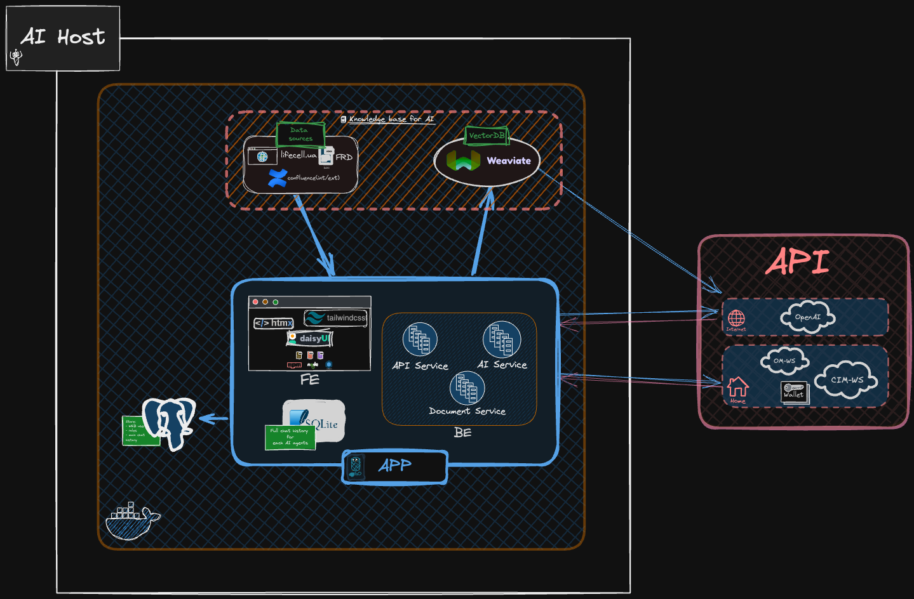
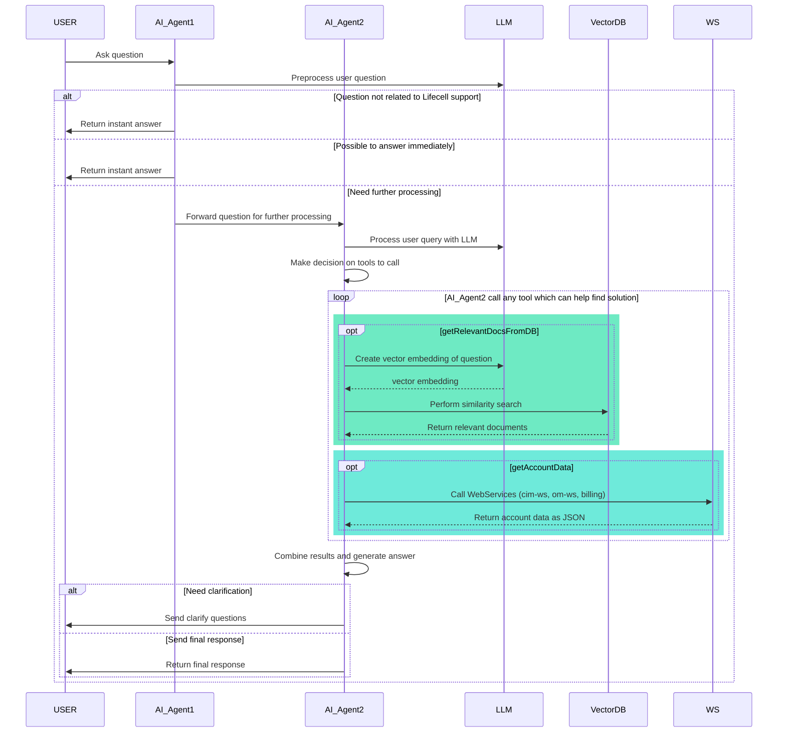

[](https://gitlab.dev.ict/golang/go-ai/-/commits/master)
[](https://gitlab.dev.ict/golang/go-ai/-/releases)

# AI VoIP customer support 🤖
> **`FE + BE for Lifecel AI VoIP customer support`**
---

## DEMO


---

[[_TOC_]]

## USAGE

### Quick start 🚀

- [Makefile](Makefile) help

  ```bash
  make help
  ```

- Build FE + run local

  ```bash
  make dev-fe
  ```

- Run in Docker

  ```bash
  docker compose up --build --force-recreate
  ```

### Docker files

- [docker-compose.yml](docker-compose.yml)
- [Dockerfile.multi-stage](Dockerfile.multi-stage)
- [**Weaviate**: docker-compose.yml](services/weaviate/docker/dev/weaviate_prom_graphana/docker-compose.yml)
- [**Weaviate**: Dockerfile](services/weaviate/docker/dev/weaviate_prom_graphana/Dockerfile)

### Folders navigation

- [`docs`](docs) - help documentation + swagger
- [`web`](web)  - FE code
- [`services/weaviate`](services/weaviate) - Vector DB logic + docker files for Weaviate

## TASKS 📌

- [ ] GO APP
  - [ ] BE
    - [x] Implement parser for different doc types
      - [x] DOCX
      - [x] PDF
      - [x] WEB(HTML)
    - [x] Integration with OpenAI API
    - [ ] AI logic
  - [ ] FE
    - [x] Stage #1
      - [x] Vector DB Admin page
        - [x] Add documents DOCX
        - [ ] Add documents WEB(HTML) by URL
      - [x] Chat page for VoIP customers
        - [x] chat functionalities
          - [x] dynamic print messages
          - [x] pretty format message from AI by `highlight.js` and `marked`
        - [x] history chats
    - [ ] Stage #2
      - [ ] redesign history chats
    - [ ] Stage #3
- [ ] VectorDB
  - [x] Researching: Find the most powerful open source vector database(easy setup, maintain, configure + stable + development team continues to develop and continue to improve)
  - [x] Weaviate deploy
  - [x] Weaviate setup

## Project components 🏗️

- **`FE`** - Frontend: _TailwindCSS, DaisyUI, HTMX, JQuery, JavaScript_
- **`BE`** - Backend: _Golang(`1.22.3`), Fiber, GORM, SQLite, Swagger, Air, Swaggo, Docker_
- **`AI`** - AI models: _GPT-4, GPT-4o, Llama3, Whisper_
- **`DB Vector`**: _Weaviate_
- **`DB`**: _Postgres, SQLite_
- **`Monitoring`**: _Prometheus, Grafana_

System | URL | -
---------|----------|---------
 Weaviate | <http://ai.dev.ict:8082/> | -
 Weaviate Metrics | <http://ai.dev.ict:2112/metrics> | -
 Grafana | <http://ai.dev.ict:3000/> | -
 Prometheus | <http://ai.dev.ict:9090> | -

## APP config paramaters ⚙️

<details><summary>Click to expand <strong>APP config paramaters</strong></summary>

<table style="border-spacing: 4px;border-style: ridge;border-color:black;color: rgb(32, 32, 32);">
  <thead style="background: #cc15c3;color: #fff;text-transform: uppercase;font-size: 12px;">
    <tr>
      <th style="padding-left: 22; padding-right: 22;">Category</th>
      <th>Env Var</th>
      <th style="padding-left: 22; padding-right: 22;">Flag</th>
      <th>Default Value</th>
      <th style="padding-left: 50; padding-right: 40;">Description</th>
    </tr>
  </thead>
  <tbody style="text-align:center;font-size: 12px; letter-spacing: 0px;">
    <tr style="background-color: palegreen;font-family: 'Segoe UI', Tahoma, Geneva, Verdana, sans-serif;">
      <td><strong>CIM-WS</strong></td>
      <td>CIMWS_API_URL</td>
      <td>-cimws_url</td>
      <td style="font-size: xx-small;">http://dev-main-tm-cim-1.dev.ict:8080/astelit-cim-ws/cim-services/cim</td>
      <td>CIM API URL</td>
    </tr>
    <tr style="background-color: palegreen;font-family: 'Segoe UI', Tahoma, Geneva, Verdana, sans-serif;">
      <td><strong>CIM-WS</strong></td>
      <td>CIMWS_API_USERNAME</td>
      <td>-cimws_u</td>
      <td>"iguana"</td>
      <td>CIM API username</td>
    </tr>
    <tr style="background-color: palegreen;font-family: 'Segoe UI', Tahoma, Geneva, Verdana, sans-serif;">
      <td><strong>CIM-WS</strong></td>
      <td>CIMWS_API_PASSWORD</td>
      <td>-cimws_p</td>
      <td>"iguana"</td>
      <td>CIM API password</td>
    </tr>
    <tr style="background-color: palegreen;font-family: 'Segoe UI', Tahoma, Geneva, Verdana, sans-serif;">
      <td><strong>CIM-WS</strong></td>
      <td>CIMWS_API_TO</td>
      <td>-cimws_to</td>
      <td>20</td>
      <td>Timeout for CIM API in seconds</td>
    </tr>
    <tr style="background-color: palegreen;font-size:x-small ;font-family: 'Segoe UI', Tahoma, Geneva, Verdana, sans-serif;">
      <td><strong>CIM-WS</strong></td>
      <td>CIMWS_API_DEBUG</td>
      <td>-cimws_debug</td>
      <td>false</td>
      <td>Enables debug mode for CIM API</td>
    </tr>
    <tr style="background-color: palegreen;font-family: 'Segoe UI', Tahoma, Geneva, Verdana, sans-serif;">
      <td><strong>OM-WS</strong></td>
      <td>OMWS_API_URL</td>
      <td>-omws_url</td>
      <td>"http://dev-main-tm-om-1.dev.ict:8080"</td>
      <td>OM API URL</td>
    </tr>
    <tr style="background-color: palegreen;font-family: 'Segoe UI', Tahoma, Geneva, Verdana, sans-serif;">
      <td><strong>OM-WS</strong></td>
      <td>OMWS_API_USERNAME</td>
      <td>-omws_u</td>
      <td>"OM"</td>
      <td>OM API username</td>
    </tr>
    <tr style="background-color: palegreen;font-family: 'Segoe UI', Tahoma, Geneva, Verdana, sans-serif;">
      <td><strong>OM-WS</strong></td>
      <td>OMWS_API_PASSWORD</td>
      <td>-omws_p</td>
      <td>"P@ssw0rd"</td>
      <td>OM API password</td>
    </tr>
    <tr style="background-color: palegreen;font-family: 'Segoe UI', Tahoma, Geneva, Verdana, sans-serif;">
      <td><strong>OM-WS</strong></td>
      <td>OMWS_API_TO</td>
      <td>-omws_to</td>
      <td>10</td>
      <td>Timeout for OM API in seconds</td>
    </tr>
    <tr style="background-color: palegreen;font-family: 'Segoe UI', Tahoma, Geneva, Verdana, sans-serif;">
      <td><strong>OM-WS</strong></td>
      <td>OMWS_API_DEBUG</td>
      <td>-omws_debug</td>
      <td>false</td>
      <td>Enables debug mode for OM API</td>
    </tr>
    <tr style="background-color: palegreen;font-family: 'Segoe UI', Tahoma, Geneva, Verdana, sans-serif;">
      <td><strong>APP: Logging</strong></td>
      <td>APP_LOG_TO_TERM</td>
      <td>-l_oc</td>
      <td>true</td>
      <td>Enables console output for logs</td>
    </tr>
    <tr style="background-color: palegreen;font-family: 'Segoe UI', Tahoma, Geneva, Verdana, sans-serif;">
      <td><strong>APP: Logging</strong></td>
      <td>APP_LOG_LVL</td>
      <td>-l_lvl</td>
      <td>"debug"</td>
      <td>Specifies log level (debug, info, warn, error, fatal, panic)</td>
    </tr>
    <tr style="background-color: palegreen;font-family: 'Segoe UI', Tahoma, Geneva, Verdana, sans-serif;">
      <td><strong>APP: Logging</strong></td>
      <td>APP_LOG_COLOR</td>
      <td>-l_color</td>
      <td>true</td>
      <td>Enables colorized log output</td>
    </tr>
    <tr style="background-color: palegreen;font-family: 'Segoe UI', Tahoma, Geneva, Verdana, sans-serif;">
      <td><strong>APP: Logging</strong></td>
      <td>APP_LOG_FILE</td>
      <td>-l_file</td>
      <td>"slog.log"</td>
      <td>Specifies log file name (used with -l_of)</td>
    </tr>
    <tr style="background-color: palegreen;font-family: 'Segoe UI', Tahoma, Geneva, Verdana, sans-serif;">
      <td><strong>APP: Logging</strong></td>
      <td>APP_LOG_LINE_SZ</td>
      <td>-l_lsz</td>
      <td>"500"</td>
      <td>Maximum line size for log output</td>
    </tr>
    <tr style="background-color: palegreen;font-family: 'Segoe UI', Tahoma, Geneva, Verdana, sans-serif;">
      <td><strong>APP: Logging</strong></td>
      <td>APP_LOG_TO_FILE</td>
      <td>-l_of</td>
      <td>-</td>
      <td>Enables log file output</td>
    </tr>
    <tr style="background-color: palegreen;font-family: 'Segoe UI', Tahoma, Geneva, Verdana, sans-serif;">
      <td><strong>APP: Logging</strong></td>
      <td>APP_LOG_AS_JSON</td>
      <td>-l_ofj</td>
      <td>-</td>
      <td>Enables log output in JSON format</td>
    </tr>
    <tr style="background-color: palegreen;font-family: 'Segoe UI', Tahoma, Geneva, Verdana, sans-serif;">
      <td><strong>APP: Logging</strong></td>
      <td>APP_LOG_RT</td>
      <td>-l_rt</td>
      <td>"day"</td>
      <td>Log rotation period (day, hour, min)</td>
    </tr>
    <tr style="background-color: palegreen;font-family: 'Segoe UI', Tahoma, Geneva, Verdana, sans-serif;">
      <td><strong>APP: Logging</strong></td>
      <td>APP_LOG_TMPL</td>
      <td>-l_templ</td>
      <td>"{{datetime}} {{level}} [{{rid}}]..."</td>
      <td>Log line template</td>
    </tr>
    <tr style="background-color: palegreen;font-family: 'Segoe UI', Tahoma, Geneva, Verdana, sans-serif;">
      <td><strong>APP: Networking</strong></td>
      <td>GO_AI_PORT</td>
      <td>-p</td>
      <td>8008</td>
      <td>Application port</td>
    </tr>
    <tr style="background-color: palegreen;font-family: 'Segoe UI', Tahoma, Geneva, Verdana, sans-serif;">
      <td><strong>APP: Networking</strong></td>
      <td>APP_HOST</td>
      <td>-</td>
      <td>"0.0.0.0"</td>
      <td>Host IP for the application</td>
    </tr>
    <tr style="background-color: palegreen;font-family: 'Segoe UI', Tahoma, Geneva, Verdana, sans-serif;">
      <td><strong>APP: Networking</strong></td>
      <td>-</td>
      <td>-prxon</td>
      <td>-</td>
      <td>Enables proxy support</td>
    </tr>
    <tr style="background-color: palegreen;font-family: 'Segoe UI', Tahoma, Geneva, Verdana, sans-serif;">
      <td><strong>APP: Security</strong></td>
      <td>LDAP_URL</td>
      <td>-</td>
      <td>"ldaps://astelit.ukr:636"</td>
      <td>LDAP URL for user authentication</td>
    </tr>
    <tr style="background-color: palegreen;font-family: 'Segoe UI', Tahoma, Geneva, Verdana, sans-serif;">
      <td><strong>APP: Security</strong></td>
      <td>LDAP_ADM_USER</td>
      <td>-</td>
      <td>"DevPortalADconnect@astelit.ukr"</td>
      <td>LDAP admin username</td>
    </tr>
    <tr style="background-color: palegreen;font-family: 'Segoe UI', Tahoma, Geneva, Verdana, sans-serif;">
      <td><strong>APP: Security</strong></td>
      <td>LDAP_ADM_PASS</td>
      <td>-</td>
      <td>"E-YrH8S#XLT5"</td>
      <td>LDAP admin password</td>
    </tr>
    <tr style="background-color: palegreen;font-family: 'Segoe UI', Tahoma, Geneva, Verdana, sans-serif;">
      <td><strong>APP: Security</strong></td>
      <td>LDAP_BASE</td>
      <td>-</td>
      <td>"OU=ASTELIT,DC=astelit,DC=ukr"</td>
      <td>LDAP base directory for the domain</td>
    </tr>
    <tr style="background-color: palegreen;font-family: 'Segoe UI', Tahoma, Geneva, Verdana, sans-serif;">
      <td><strong>APP: Security</strong></td>
      <td>-</td>
      <td>-ssl</td>
      <td>"/usr/local/share/ca-certificates/AllInOne.pem"</td>
      <td>Path to SSL cert</td>
    </tr>
    <tr style="background-color: palegreen;font-family: 'Segoe UI', Tahoma, Geneva, Verdana, sans-serif;">
      <td><strong>APP: Debug</strong></td>
      <td>-</td>
      <td>-d</td>
      <td>-</td>
      <td>Enables debug mode for the application</td>
    </tr>
    <tr style="background-color: palegreen;font-family: 'Segoe UI', Tahoma, Geneva, Verdana, sans-serif;">
      <td><strong>APP: Environment</strong></td>
      <td>-</td>
      <td>-dev</td>
      <td>true</td>
      <td>Enables development mode</td>
    </tr>
    <tr style="background-color: palegreen;font-family: 'Segoe UI', Tahoma, Geneva, Verdana, sans-serif;">
      <td><strong>APP: Environment</strong></td>
      <td>-</td>
      <td>-env-file</td>
      <td>-</td>
      <td>Specifies the file containing environment variables</td>
    </tr>
    <tr style="background-color: palegreen;font-family: 'Segoe UI', Tahoma, Geneva, Verdana, sans-serif;">
      <td><strong>APP: Application</strong></td>
      <td>-</td>
      <td>-lt</td>
      <td>"layouts/main"</td>
      <td>Specifies the application port</td>
    </tr>
    <tr style="background-color: palegreen;font-family: 'Segoe UI', Tahoma, Geneva, Verdana, sans-serif;">
      <td><strong>APP: Application</strong></td>
      <td>IS_AI_DB_OFF</td>
      <td>-aidboff</td>
      <td>false</td>
      <td>disable AI DB functionalities</td>
    </tr>
    <tr style="background-color: palegreen;font-family: 'Segoe UI', Tahoma, Geneva, Verdana, sans-serif;">
      <td><strong>APP: Application</strong></td>
      <td>IS_PROXY_OFF</td>
      <td>-prxoff</td>
      <td>false</td>
      <td>disable resolving HTTP proxy from env</td>
    </tr>
    <tr style="background-color: palegreen;font-family: 'Segoe UI', Tahoma, Geneva, Verdana, sans-serif;">
      <td><strong>APP: Application</strong></td>
      <td>HTTP_CLIENT_TO</td>
      <td>-hcto</td>
      <td>300</td>
      <td>HTTP client time out</td>
    </tr>
    <tr style="background-color: palegreen;font-family: 'Segoe UI', Tahoma, Geneva, Verdana, sans-serif;">
      <td><strong>APP: Application</strong></td>
      <td>-</td>
      <td>-tit</td>
      <td>"Lifecell-AI"</td>
      <td>Application title</td>
    </tr>
    <tr style="background-color: palegreen;font-family: 'Segoe UI', Tahoma, Geneva, Verdana, sans-serif;">
      <td><strong>APP: Vector DB</strong></td>
      <td>-</td>
      <td>-vdb</td>
      <td>-</td>
      <td>Initiates base process for embedding data to vector DB</td>
    </tr>
    <tr style="background-color: palegreen;font-family: 'Segoe UI', Tahoma, Geneva, Verdana, sans-serif;">
      <td><strong>Weaviate</strong></td>
      <td>WEAVIATE_HOST</td>
      <td>-wv_h</td>
      <td>"ai.dev.ict"</td>
      <td>Weaviate host (localhost, dev-worker-7, etc.)</td>
    </tr>
    <tr style="background-color: palegreen;font-family: 'Segoe UI', Tahoma, Geneva, Verdana, sans-serif;">
      <td><strong>Weaviate</strong></td>
      <td>-</td>
      <td>-wv_lvl</td>
      <td>"error"</td>
      <td>Weaviate log level</td>
    </tr>
    <tr style="background-color: palegreen;font-family: 'Segoe UI', Tahoma, Geneva, Verdana, sans-serif;">
      <td><strong>Weaviate</strong></td>
      <td>WEAVIATE_PORT</td>
      <td>-wv_p</td>
      <td>8082</td>
      <td>Weaviate port</td>
    </tr>
    <tr style="background-color: palegreen;font-family: 'Segoe UI', Tahoma, Geneva, Verdana, sans-serif;">
      <td><strong>Weaviate</strong></td>
      <td>WEAVIATE_SCHEME</td>
      <td>-wv_sch</td>
      <td>"http"</td>
      <td>Weaviate scheme (http, https)</td>
    </tr>
    <tr style="background-color: palegreen;font-family: 'Segoe UI', Tahoma, Geneva, Verdana, sans-serif;">
      <td><strong>Misc</strong></td>
      <td>CONFLUENCE_TOKEN</td>
      <td>-</td>
      <td>-</td>
      <td>Token for Confluence API access</td>
    </tr>
    <tr style="background-color: coral; ">
      <td><strong>Misc</strong></td>
      <td><strong>OPENAI_API_KEY</strong></td>
      <td>-</td>
      <td>-</td>
      <td><strong>API key for accessing OpenAI services</strong></td>
    </tr>
  </tbody>
</table>

</details>

## DIAGRAMS

### `->` **Components**

<details><summary><b style="color: yellow">Click to expand</b></summary>



</details>

### `->` **SEQUENCE**

<details><summary>Click to expand</summary>



</details>

### `->` KnowledgeBase illustration example

<details><summary>Click to expand</summary>


</details>

## Weaviate + Prometheus + Grafana

#### Run

```bash
cd ./services/weaviate/docker/dev/weaviate_prom_graphana
docker compose up
```

#### Stop

```bash
docker compose down
```

#### Check

```bash
docker compose ls
docker ps
```
