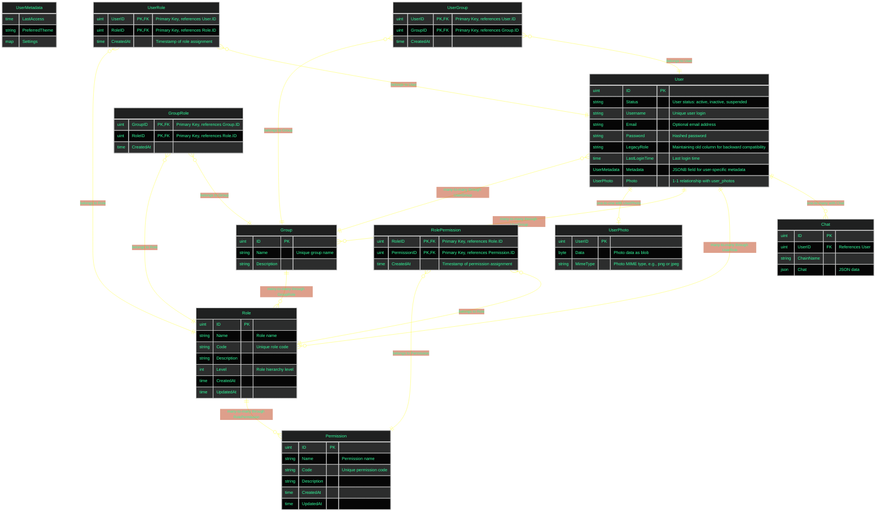
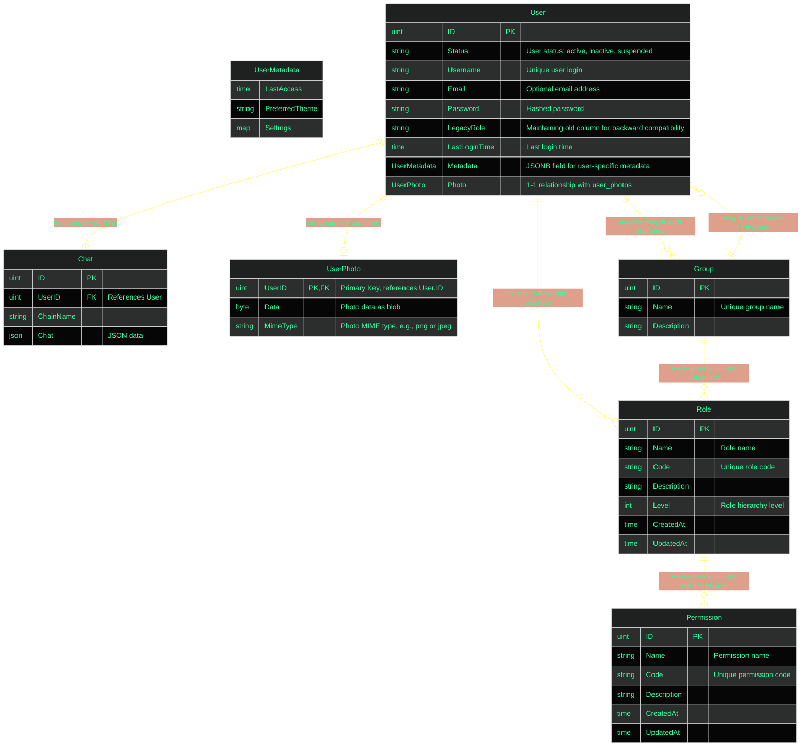

### Diag DB

```mermaid
%%{
  init: {
    'theme': 'dark',
    'themeVariables': {
        'primaryColor': '#ffff33',
        'primaryTextColor': '#ac19bd',
        'secondaryColor': '#33ff9f',
        'tertiaryColor': '#bd4119',
        'tertiaryTextColor': '#bd4119',
        'backgroundColor': '#ffff33',
        'borderColor': '#ffff33',
        'lineColor': '#ffff33',
        'textColor': '#33ff9f'
    }
  }
}%%

erDiagram
    User {
        uint ID PK
        string Status "User status: active, inactive, suspended"
        string Username "Unique user login"
        string Email "Optional email address"
        string Password "Hashed password"
        string LegacyRole "Maintaining old column for backward compatibility"
        time LastLoginTime "Last login time"
        UserMetadata Metadata "JSONB field for user-specific metadata"
        UserPhoto Photo "1-1 relationship with user_photos"
    }

    UserMetadata {
        time LastAccess
        string PreferredTheme
        map Settings
    }

    Chat {
        uint ID PK
        uint UserID FK "References User"
        string ChainName
        json Chat "JSON data"
    }

    UserPhoto {
        uint UserID PK
        byte Data "Photo data as blob"
        string MimeType "Photo MIME type, e.g., png or jpeg"
    }

    Group {
        uint ID PK
        string Name "Unique group name"
        string Description
    }

    Permission {
        uint ID PK
        string Name "Permission name"
        string Code "Unique permission code"
        string Description
        time CreatedAt
        time UpdatedAt
    }

    Role {
        uint ID PK
        string Name "Role name"
        string Code "Unique role code"
        string Description
        int Level "Role hierarchy level"
        time CreatedAt
        time UpdatedAt
    }

    %% Define UserRole (junction table for User and Role)
    UserRole {
        uint UserID PK,FK "Primary Key, references User.ID"
        uint RoleID PK,FK "Primary Key, references Role.ID"
        time CreatedAt "Timestamp of role assignment"
    }

    RolePermission {
        uint RoleID PK,FK "Primary Key, references Role.ID"
        uint PermissionID PK,FK "Primary Key, references Permission.ID"
        time CreatedAt "Timestamp of permission assignment"
    }

    GroupRole {
        uint GroupID PK,FK "Primary Key, references Group.ID"
        uint RoleID PK,FK "Primary Key, references Role.ID"
        time CreatedAt
    }

    UserGroup {
        uint UserID PK,FK "Primary Key, references User.ID"
        uint GroupID PK,FK "Primary Key, references Group.ID"
        time CreatedAt
    }

    %% Relationships
    User ||--o{ Chat : "one-to-many with Chat"
    User ||--o{ Role : "many-to-many through UserRole"
    User ||--o{ Group : "many-to-many through UserGroup"
    User ||--o| UserPhoto : "one-to-one with UserPhoto"

    Group ||--o{ Role : "many-to-many through GroupRole"
    Group ||--o{ User : "many-to-many through UserGroup"

    Role ||--o{ Permission : "many-to-many through RolePermission"

    UserRole }o--|| User : "belongs to User"
    UserRole }o--|| Role : "belongs to Role"

    RolePermission }o--|| Role : "belongs to Role"
    RolePermission }o--|| Permission : "belongs to Permission"

    GroupRole }o--|| Group : "belongs to Group"
    GroupRole }o--|| Role : "belongs to Role"

    UserGroup }o--|| User : "belongs to User"
    UserGroup }o--|| Group : "belongs to Group"

```

### Diag DB 2

```mermaid
%%{
  init: {
    'theme': 'dark',
    'themeVariables': {
        'primaryColor': '#ffff33',
        'primaryTextColor': '#ac19bd',
        'secondaryColor': '#33ff9f',
        'tertiaryColor': '#bd4119',
        'tertiaryTextColor': '#bd4119',
        'backgroundColor': '#ffff33',
        'borderColor': '#ffff33',
        'lineColor': '#ffff33',
        'textColor': '#33ff9f'
    }
  }
}%%

erDiagram
    UserMetadata {
        time LastAccess
        string PreferredTheme
        map Settings
    }

    Chat {
        uint ID PK
        uint UserID FK "References User"
        string ChainName
        json Chat "JSON data"
    }

    UserPhoto {
        uint UserID PK, FK "Primary Key, references User.ID"
        byte Data "Photo data as blob"
        string MimeType "Photo MIME type, e.g., png or jpeg"
    }

    User {
        uint ID PK
        string Status "User status: active, inactive, suspended"
        string Username "Unique user login"
        string Email "Optional email address"
        string Password "Hashed password"
        string LegacyRole "Maintaining old column for backward compatibility"
        time LastLoginTime "Last login time"
        UserMetadata Metadata "JSONB field for user-specific metadata"
        UserPhoto Photo "1-1 relationship with user_photos"
    }

    Group {
        uint ID PK
        string Name "Unique group name"
        string Description
    }

    Permission {
        uint ID PK
        string Name "Permission name"
        string Code "Unique permission code"
        string Description
        time CreatedAt
        time UpdatedAt
    }

    %% Define Role entity with hierarchical Level
    Role {
        uint ID PK
        string Name "Role name"
        string Code "Unique role code"
        string Description
        int Level "Role hierarchy level"
        time CreatedAt
        time UpdatedAt
    }

    %% Relationships
    User ||--o{ Chat : "one-to-many with Chat"
    User ||--o{ Role : "many-to-many through UserRole"
    User ||--o{ Group : "many-to-many through UserGroup"
    %% User has one UserPhoto (1-to-1)
    User ||--o| UserPhoto : "one-to-one with UserPhoto"

    Group ||--o{ Role : "many-to-many through GroupRole"
    Group ||--o{ User : "many-to-many through UserGroup"

    Role ||--o{ Permission : "many-to-many through RolePermission"

```
